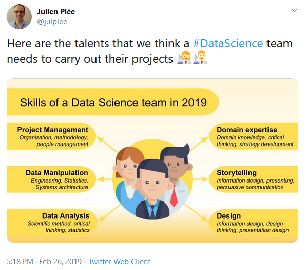

# Data science and the art of storytelling

## When we look at data scientists job offers nowadays, this is hard to spot a common definition of what a data scientist does in 2019. Basically, there are a lot of different missions called a “Data Scientist” role.

## The Swiss-army knife of the data scientist

Also, earlier last year we wrote an article about what we call “Data Science Engineers” 👩‍🔬👨‍🔬 which details how we defined a bridge role between data science and data engineering. Plus, it is a good rundown for what data scientists do when they join a software editor.

This hybrid role allows us to give an answer to two powerful needs coming from data science projects in a SaaS environment:

* the knowledge of data science fields
* the knowledge of engineering practices

That’s why I wrote the current rundown which gathers the major talents I consider that data scientists should train during their career to thrive and ensure the success of the data science projects they are participating in. In the end this work helped us complete our engineering ladder with a certain skillset that our Data Science Engineers must share at Synthesio.

All of this is based on my experience as a CTO at Synthesio

This is the first articles of a series of five

To be successful in their projects data scientists must gather multiple talents in their project team. This is a tweet that I published earlier this year

## Storytelling for a data scientist

To me, storytelling is an art that is likely the major skill that a data scientist must master.

Why? Because it allows data scientists to popularize their knowledge to the different stakeholders whose management is part of.

And this need became recently even more important because **more and more companies now discuss the data science strategy in their business strategy**.

In order to be able to take the best decisions executives will strongly benefit from understanding thoroughly how their company will be able to leverage an analytics model, which features and insights it can bring to the business and where the results come from.

This is the same thing for a customer which uses your features:

`Where does this positive sentiment given by the model come from? Which words were decisive to predict this sentence is positive?`

To make an executive or a customer able to use and to love a data science feature, **you must ensure they understand perfectly “how” the things work, what’s going on between the input data and the result**.

At Synthesio, we have a bunch of practices to ensure that data scientists train their storytelling skill:

* they work in an agile cycle with demos where they present their work to the whole R&D. This helps us popularize their messages as this demo is showed to various roles, not always technical ones
* they are encouraged to document their research phases to describe the problems they met, how they answered those problems, why they chose this model in the end
* they work in feature teams which basically gather several different roles so that it ensures that they are used to speak daily to different people with different levels of knowledge
* they are doing regular 1:1s with their management who are not as skilled as they are on their specialties and talking about their achievements will also ask for popularization