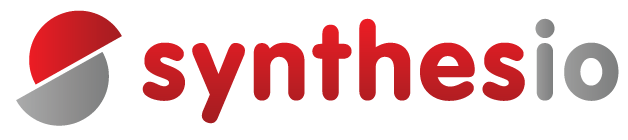

# Introducing Synthesio&#39;s R&amp;D

## Synthesio: Leading Global Social Intelligence Suite

 

Synthesio is a Software Editor that provides brands and agencies around the world with the social listening tools and audience insights they need to measure the impact of social and mainstream media conversations

To build these awesome capabilities we are striving to build an awesome R&amp;D team

# Who we are

The R&amp;D team of Synthesio is composed of a bunch of talented people divided in four sub-teams :

- the Quality Assurance (QA) team ensuring that software meet top quality requirements
- the System Reliability Engineering (SRE) team deploying and automating the surroundings of our infrastructure and our hosting
- the Front-end Engineering team ensuring we deliver awesome features to our customers by using the most appropriate technologies
- the Data Engineering team striving on manipulating tons of data and billions of documents every day
- the Data Science team spearheading our last AI innovations about Natural Language Processing (NLP), Image Recognition and Trends detection

Each team fosters their set of special skills that gives us the ability to create, maintain and advance our features and software

# What we&#39;re working on

Our core stake is the scalability of an infrastructure that manipulates big data and displays insights to our customers

We strongly believe in open-source projects: we use them and we are happy to contribute to them

We use various technologies such as Cassandra, ElasticSearch, Ansible, Kafka… which are quite adapted when for example you tackle reindexing 90 billions of documents and are perfectly integrated in our microservices constellation

On the Front-end side we thrive working with ES6, ReactJS with Redux, Yarn…

The technical problems we have to solve are very stimulating because they are pretty rare due to the amount of data we have to manipulate (around 3 Peta Bytes)

Whatever you are a Data Scientist or a Front-end Engineer you will probably work in one of our Feature squad. A squad is a team with at least one representative of every trade. For example two Front-end Engineers, two Data Engineers, one Data Scientist and one Product Owner

We have an obsession for measuring how things work, how our features are used by customers, to know the status of micro-services in our processing chain, the performance of every node of the infrastructure…

  

# What are our beliefs

We have a strong belief that humanity, career&#39;s path and skills development are the most important thing a company can bring to its people

Thus at Synthesio you can only thrive on fostering mutual aid to your pairs. Trust and kindness are also key values of our people. When you met an issue, everyone will be in a &quot;how may I help you mindset?&quot; and this is just our best solutions for now to ensure everyone is happy, our customers as our developers

Also quality in what we do is a major thing for us. As a Software Editor, our code is our main asset. Quality must come out features and customer feedback is something we look for constantly to improve our software. Also this is a big thing to improve our skills

Don&#39;t hesitate to reach out to us if you want to discuss, organize a meetup with us in our building or elsewhere or everything you would like to bring to us