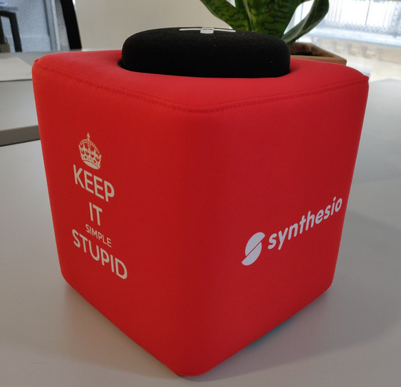

# My manager experience about remote work
## This article describes my experience with remote work as a manager. In my current company, we have set a remote-friendly culture which gives every person the ability to work remotely as they want while some others are full-time remote workers

As we know that remote work has strong benefits but also drawbacks that we are going to discuss further, we also strongly believe that remote working has a real positive balance in the end.

  

# A bit of context

In less than one year we grew from 20 to more than 50 people in R&D with 5 full-time remote workers and the rest of the R&D being able to work remotely as they want.

When you join our teams, you can be in one of these two ways:

* you are either a full-remote worker
* or you work at the office

## If you are a full-remote worker

It means that you are an engineer living at home. You come at the office once a month, two to three days, to meet with the rest of the team.

## If you work at the office

When you work from our buildings, you can enjoy as many remote days as you need or want every week. You don’t need to explain why. You just have to fill a remote day in the pay tool linked to our calendars so that everybody knows where to find you that is not in the office.

# The Remote only Manifesto

We use principles coming from the [**Remote only Manifesto**](https://www.remoteonly.org/).
They are written in the same way as the Agile Manifesto so the same golden rule applies which is:

`don’t forget that the right part after the over (or instead) keyword, it’s important enough to be written down.`

In the following, we will not necessarily browse the principles from the manifesto in order but we are going to do some poking around.

## Hiring and working from everywhere
The first principle that got our attention was _“Hiring and working from all over the world instead of from a central location”_.
It is maybe the hardest principle to execute when you come from a company where the whole team was collocated in one single building. But as time passes we are proud to receive more and more people in the team who are full-time remote workers.

## Software for collaboration

They work from home everyday so we use basic tools such as **Slack**, **Jira**, **Google Meet**, **Confluence**… to ensure that every important communication is written down and that you can find it again later, refer to it and discuss it again.

Direct communication that benefits from seeing the other person is done through **video calls**.

## Asynchronous communication

We’re used to **asynchronous communication** as well as recommended by the third principle “Writing down and recording knowledge over oral explanations” and the seventh _“Asynchronous communication over synchronous communication”_.
In some cases it could be very useful. Imagine a team composed of people working in different time zones, in this case we will capture the prominent information of our daily scrum meetings in a Slack channel dedicated to this project (and team) so that we ensure everyone can get the knowledge of the day.
Maybe we can still improve ourselves on the recording part. For now we’d rather like to replay the event in person for those who missed it but it’s maybe working thanks to our quite little scale.

## Our Slack channels

As Slack is our communication tool for all direct and group conversations we defined some conventions to share meaningful information depending on who you are and what you do in the company.

For example, we have some **channels dedicated to some roles** (e.g., a channel for front-end discussions), **some channels dedicated to a process or a precise topic** (e.g., a channel about hiring) but also **channels with a general topic shared by almost everyone** (e.g., a “funtime” channel to share everything that is funny through the company).

## Equipment for communication

Good appliances are a must have for good communication between team mates that are not in the same place.

We chose this kind of equipment that fulfill our needs of having a good sound and a good video for pleasant discussions.

Here are some the appliances that we use with remote people and their use case:

* **Jabra speakers** used for instance for standup meetings.
* **Logitech Conference Cameras** used for longer meetings such as for instance Sprint Planning meetings and retrospectives. This is helpful to see people faces hence non verbal communication when you look for solving problems.
* a **Catchbox** and bookshelf speakers used when a lot of people run into a meeting for instance for our demos every two weeks where the whole R&D (more than 50 people) attend.

## Our ritual of having full remote workers come home

Full-time remote workers will come monthly two to three days at the office to meet the team. For us it is healthy to keep a sense of belonging to the team and to create strong synergies and relationships between people.
Of course we ensure that these “onsite” days are useful to people and that they will enjoy seeing others because they will work on same stuff together so that it makes full sense to meet.
Also having the remote guys coming once a month allows us to enjoy hangouts and after works together as well which is a very strong way of bonding a team.

## Flexible working hours

_“The results of work over the hours put in”_ is the most important principle for us. This is not something that we wait to think after setting remote work but something we truly believe in our day to day work.

Don’t bother people with how many hours they are working, just define together clear expectations and agree on them. This way only results count, not the way you achieve them.

**This way of thinking is what I recommend to every manager, this is not only to apply when you set remote work options, this is the way to go as a manager**. This is is a key factor to succeed your projects and get your teams thriving plus enjoying their days at work.

## The most important principle and why it works for us

“The results of work over the hours put in” is the most important principle for us. This is not something that we wait to think after setting remote work but something we truly believe in our day to day work.

Don’t bother people with how many hours they are working, just define together clear expectations and agree on them. This way only results count, not the way you achieve them

**This way of thinking is what I recommend to every manager, this is not only to apply when you set remote work options, this is the way to go as a manager**. This is is a key factor to succeed your projects and get your teams thriving plus enjoying their days at work.

# Maybe some drawbacks

The real drawback behind remote work is that a few of us notice they work more than less. It’s necessary to define strong rules when you work from home as you will soon be tempted to work all day long. So you need more than never to define your own balance between private and professional life. One of our engineers, Christophe, wrote an excellent article about how to keep an healthy way of working as a remote and avoid overheat.

Of course if you skip some rules, tools or best practices you can suffer from having people in different places and get poor communication and lack of productivity in the end. That’s why I still have a few advice to give that can help managers to build a good framework for remote work to work well below.

Let’s use them with the best practices mentioned previously to thrive with your remote working!

# A few advice for managers

If you are a manager and your people want to take remote days, here are some personal advice that I can share:

## Trust your people

As I like to say, trust is the gift you should offer first without any critical reasoning. Most of the time, people want to work from home because this is more convenient for them. This could be more convenient for many reasons that I don’t mind but there is one for sure: **this allows them to work at most efficiency**.

## Strengthen your management skills

Managing full-remote workers or people having only a few days working from home will help you answer questions as to your management style, the way you foster relationships, how you create and maintain them, how you build trust and rapport with your team mates, ensure you set together measurable goals… This is all good to improve your management skills.

## Communicate the framework

The framework consists of all the rules that will allow your company to work properly with remote workers.

You will probably not define it yourself and it will mostly come from a shared vision with your team. But in the end, this is your role to ensure that the framework is known by everybody in the team, everybody who joins the company, and that the rules are updated each time we find that a new way of doing things is a good solution for our current lifetime.

## Take time to do 1:1 with your full-time remote workers

Even if your full-time remote workers are not your direct reports but skip levels, I would advise you to take time to see them in one on ones regularly.

This is very important to foster the relationship between them and you (and the company) but a lot of articles are specialized on the topic and I won’t detail here.

## Continuous learning is key everywhere, hence here as well

Continuous learning, Plan Do Check Act,… and the whole mindset around applies here as they apply in the rest of your work.

It’s always a good thing when you add a new way of working with your remote workers to test it for a short period, assess it with the team and adapt it as needed and so fort…

# Our “Work from anywhere” week

This year we also did what we called a “Work from anywhere week”. It was a whole company event that aimed at improving our way of working together whichever the conditions

The goals of the week were written like so

`“We want to keep asking how to be better, keep listening to each other, keep acknowledging our weak spots and improving them while we play to our strengths…”`

So we got engineers working from everywhere! While one was in Sicilia, another one was in Russia, another one in Norway… some of them rent a home together somewhere else in France. That made more complex our abilities to work together because for the first time we got almost all people alone and somewhere in a different location.

The result was great though and most of the teams loved it! To ensure that it works well, we prepared it a bit more than a regular week. Each team sets themselves KPI on what they wanted to achieve during this week. That was really helpful because it gave the whole company a rhythm and a possibility to see what changed on a daily basis

In the end we even felt that we sometimes achieved more than in a regular week!

So yes, remote working has drawbacks and asks for an accurate organisation of work and communication, but as soon as you integrate in your core these needs that having remote workers imply, you move a step forward and **you reap the rewards of trusting people and make their life easier and more enjoyable!**

Also keep in mind that remote working is not for everyone. Some people will be more efficient while working among their colleagues. That’s why we like our balance of letting people choose when they want to remote otherwise provide them great offices to work together.
