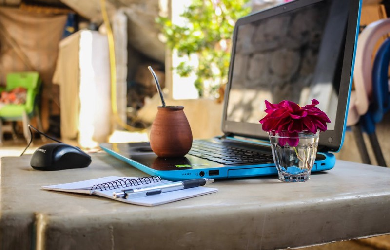
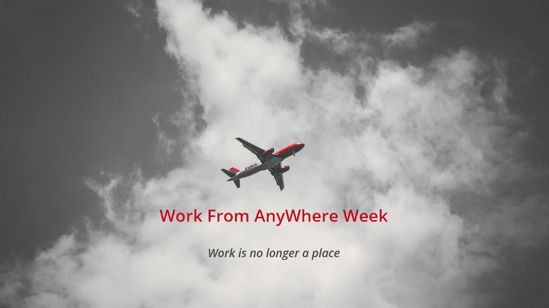

# My manager experience about remote work
## This article describes my experience of remote work as a manager. At my current company Synthesio, we have set a remote-friendly culture where every person has the ability to work remotely while some others are full-time remote workers

As we know that remote work has strong benefits but also drawbacks that we are going to discuss further, we also strongly believe that remote working has a real positive balance.

  

# A bit of context

When you join our teams, you can be in one of these two ways:

* you are either a full-remote worker
* or you work at the office

## If you are a full-remote worker

It means that you are an engineer living at home. You come at the office once a month, two to three days, to meet with the rest of the team

## If you work at the office

When you work from our buildings, you can enjoy as many as remote days that you need or want every week. You don’t need to explain why, just to fill a remote day in the pay tool linked to our calendars so that everybody knows where to find you

# The Remote only Manifesto

We use principles coming from the [**Remote only Manifesto**](https://www.remoteonly.org/).
They are written in the same way as the Agile Manifesto so the same golden rule applies:

`don’t forget that the right part after the over keyword, it’s important enough to be written down`

In the following, we will not necessarily browse the principles from the manifesto in order but we are going to do some poking around

## Hiring and working from everywhere

The first principle that got our attention was “Hiring and working from all over the world instead of from a central location”.
It is maybe the hardest principle to execute when you come from a company where the whole team was collocated in one single building. But as time passes we are proud to receive more and more people in the team who are fully remote workers.

They work from home everyday so we use basic tools such as Slack, Jira, Google Meet, Confluence… to ensure important communication is written. Direct communication that benefits from seeing the other person is done through video calls.

## Asynchronous communication

We’re used to asynchronous communication as well as recommended by the third principle “Writing down and recording knowledge over oral explanations” and the seventh “Asynchronous communication over synchronous communication”. 
In some cases it could be very useful. Imagine a team composed of people working in different time zones, in this case we will capture the prominent informations of our daily scrum meetings in a Slack channel dedicated to this project (and team) so that we ensure everyone can get the knowledge of the day. 
Maybe we can still improve ourselves on the recording part. For now we’d rather like to replay the event in person for those who missed it but it’s maybe working thanks to our scale

## Our ritual of having full remote workers come home

Full remote workers will come monthly two to three days at the office to meet the team. For us it is healthy to keep a sense of belonging to the team and to create strong synergies and relationships between people.
Of course we ensure that these “onsite” days are useful to people and that they will enjoy seeing others because they will work on same stuff together so that it makes full sense to meet.
Also having the remote guys coming once a month allows us to enjoy hangouts and after works together as well which is a very strong way of bonding a team

## Flexible working hours

The Remote work Manifesto recommends a lot of other things such as having “flexible working hours over set working hours”.
This one is pretty obvious to us.
If you trust your people to work remotely, you should trust them whatever hours they choose to work as well.

Of course this could be mitigated by the need to meet with the team at predefined hours so when it occurs you adapt to this needs. But for the rest of the time the flexibility brought to us by remote work allows everyone to adapt their working hours as needed. This is particularly helpful for everyone.

## The most important principle and why it works for us

“The results of work over the hours put in” is the most important principle for us. This is not something that we wait to think after setting remote work but something we truly believe in our day to day work.

Don’t bother people with how many hours they are working, just define together clear expectations and agree on them. This way only results count, not the way you achieve them

**This way of thinking is what I recommend to every manager, this is not only to apply when you set remote work options, this is the way to go as a manager**. This is is a key factor to succeed your projects and get your teams thriving plus enjoying their days at work.

# Maybe some drawbacks

The real drawback behind remote work is that a few of us notice they work more than less. It’s necessary to define strong rules when you work from home as you will soon be tempted to work all day long. So you need more than never to define your own balance between private and professional life. One of our engineers, Christophe, wrote [an excellent article](https://medium.com/synthesio-engineering/how-to-be-a-good-remote-worker-for-your-team-and-for-yourself-42a25ec99ba7) about how to keep an healthy way of working as a remote and avoid overheat.

# A few advice for managers

If you are a manager and your people want to take remote days, here are some personal advice that I can provide:

## Trust your people

As I like to say, trust is the gift you should offer first without any critical reasoning. Most of the time, people want to work from home because this is more convenient for them. This could be more convenient for many reasons that I don't mind but there is one for sure: **this allows them to work at most efficiency**.

## Strengthen your management skills

Managing full-remote workers or people having only a few days working from home will help you answer questions about your management style, the way you foster relationships, how you create and maintain them, how you build trust and rapport with your team mates, ensure you set together measurable goals... This is all good to improve your management skills

# Our “Work from anywhere” week

This year we also did what we called a “Work from anywhere week”. It was a whole company event that aimed at improving our way of working together whichever the conditions

The goals of the week were written like so

`“We want to keep asking how to be better, keep listening to each other, keep acknowledging our weak spots and improving them while we play to our strengths…”`

So we got engineers working from everywhere! While one was in Sicilia, another one was in Russia, another one in Norway… some of them rent a home together somewhere else in France. That made more complex our abilities to work together because for the first time we got almost all people alone and somewhere in a different location.

The result was great though and most of the teams loved it! To ensure that it works well, we prepared it a bit more than a regular week. Each team sets themselves KPI on what they wanted to achieve during this week. That was really helpful because it gave the whole company a rhythm and a possibility to see what changed on a daily basis

In the end we even felt that we sometimes achieved more than in a regular week!

So yes, remote working has drawbacks and asks for an accurate organisation of work and communication, but as soon as you integrate in your core these needs that having remote workers imply, you move a step forward and **you reap the rewards of trusting people and make their life easier and more enjoyable!**
Also keep in mind that remote working is not for everyone. Some people will be more efficient while working among their colleagues. That's why we like our balance of letting people choose when they want to remote otherwise provide them great offices to work together.