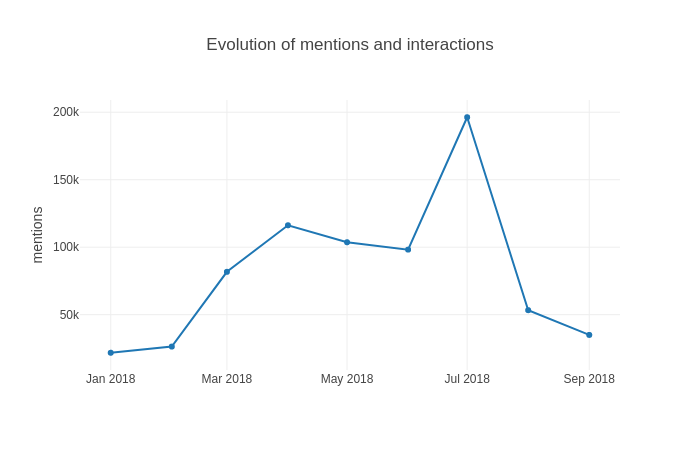

# Peaks and trends detection in time series for social data - 1st part

  **Authors:** Dimitri Trotignon

This article is the first part of a serie of articles about **time series analysis** and **automated pulses and trends detection**.

Social media are a marvellous source of data for learning about our clients. The goal of Synthesio is to collect these data, enrich them and then provide Dashboards to analyze them. But we rapidly came to the conclusion that **users do not have the time** to make all manipulations to be able to spot insights. 
The objective of the Headlines project at Synthesio is to provide a global overview of points of interest across all the variables of a dashboard in one click. 

This project is divided in two parts : the first is about pulses, the second about trends automatic detection. 
In this first part we will cover the data collection and the first exploratory analysis. 
In our case, the data is stored on ElasticSearch data bases. As we have to work on time series, we needed to aggregate data. We chose 3 intervals to have as many insights as possible : days, weeks and months.
The importance of having these 3 different ranges is that we can spot different types of Insights and events, some are really concentrated on 1 day, we can speak for example of the Black Friday which generates many contents on Social media. Others on the opposite are present on several days or weeks, for example sales or media campaigns. In these cases it is interesting to be able to spot periods as months or weeks. 

Then we also give the opportunity to the user to choose variables and metrics. For variables, users will have the choice between different choices such as **topics, countries, sentiment and site types (media, social media etc.)** for example. 
For the metrics they will be able to choose among several ones among them **volume of mention, sum of interactions (comments, likes etc.) or reach**. The idea is to see for example if a lot of people are posting about a subject on a particular date period or if some subjects generate a lot of interactions from users. 

Once we have chosen our dimensions and metrics, let’s see what the data look like 

Daily data

Weekly data

Monthly data

We can clearly see that **the data is not similar depending on the period**. Some data sets present a strong seasonality while others do not. In a general way we can see that globally monthly data is the most smooth one. On the other hand, daily data is very unstable and present many asperities. 
In the exemple above which is based on a dashboard about Formula 1 pilots and teams such as Renault F1, Mercedes AMG etc. 
We can clearly see that the there is a strong seasonality related to “Grands Prix” every two weeks, this is the perfect example of unicity of every dashboards. Other dashboards about tea for example have more mentions on winter period but with no weekly seasonality. 
As we are a Saas company, we need to build a scalable, robust and efficient model which will perform well on many different types of time series. The scalability is very important too. The model needs to be usable for many clients at the same time, and it also needs to answer fast to the clients query.

From a code organisation point of view, The pulses and trends detection module is developed as an API coded in Python language. As the majority of Synthesio's processing chain are actually in Golang, an other API has been created to communicate with front part

In the next articles of the serie we are going to deep dive into how we calculate pulses and trends
