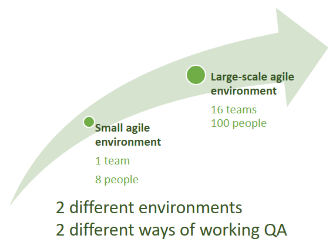
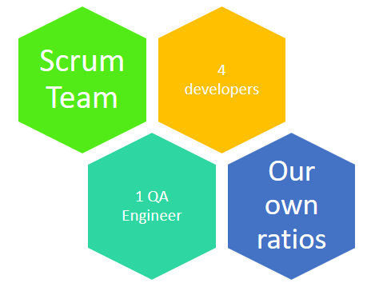
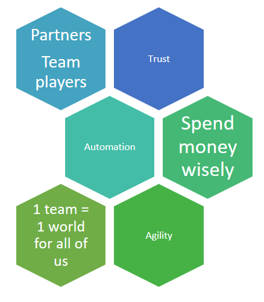

# Quality Assurance on large-scaled projects

During the last 5 years, my company grew from a 50 people company to more than 500 teammates today.

In the same time, the development teams grew from 8 to more than 100 people, and from 1 to 16 teams. Meanwhile, the number of products we sell grew from 1 to 4, and a majority of teams still work on the same product.

The way you do Quality Assurance (QA) in a small agile team is not exactly the same that you will use on large-scale projects, where you need to have a good coordination between several teams for a coherent final product release, even in an environment where each team works on their microservice.

In this article, I’ll share with you our thoughts about Quality Assurance and how we choose to organise to succeed.

## Before our growth : Quality Assurance in a “small” Agile team

Most of our teams have chosen Scrum as their working method.

In that case, Quality Assurance is ensured with one QA engineer per team. They are part of the team, they sit and work with developers, PO, Business Analyst, UX… every day of the sprint.

Our ratio is of 4 developers for 1 QA. Our sprints are 2 weeks long.

You might know that we must differentiate 2 types of testing :

* **White box testing:** done by software developers, with Unit Testing (testing code in isolation) and Integration Testing (tests going through different code layers)
* **Black box testing:** done by QA engineers inside the team, with System Testing (e.g. using Selenium), Regression Testing (using System Testing tooling), Acceptance Testing (using BDD tools), Load Testing (e.g. using jMeter), Smoke Testing (using System Testing tooling)…

As evident as it may seem, white box testing is performed during the sprint, sometimes before coding (TDD) or just after.

But **when is black box testing performed?** QA engineers take action after a User Story is moved from “in development” to “QA”.

At this moment, the QA engineer can verify the previously defined Acceptance Criteria written in the story and can create automated black box tests accordingly. They will guarantee a certain level of quality, and that we spend our QA money wisely : QA Engineer chooses to automate some of the use cases that he knows he will need many times in the future. He has all the skills and tools to do so.

## Key values

To succeed, we discovered that your team should have key values exposed below :

* Trust : QA Engineer, Product Owner and Developers must trust each other and know their role, as well as the role of their coworkers in the chain of quality. “When does one plays their role ?” must be everything but a secret for everyone involved in the team effort.
* Searching for automation : a daily question to ask. “Can I automate this task I am going to perform?”, is it advantageous to choose manual testing or to automate? One should always have the tooling ready to be able to automate what is worth automating.
* Agility : working together is a prerequisite. Inside the same team, and the same temporality. However, you will be working on a V-cycle and suffer from costly interruptions in your next sprints.

## During our growth : Scaling Agile Quality Assurance

Along time, we hired more and more developers, QAs and POs to create new teams. This created a new need for us : several teams were working on the same products, even if their scope of action was a clearly bounded context. It brought a limit on how frequently code could be integrated and a need for QA coordination emerged before releasing code into production.

So we added a new level of control to ensure global Quality Assurance of the released products. Generally when several teams need to be coordinated, a comprehensive QA model is needed before a product can be released.

In our case the different kinds of testing were not sufficient to guarantee that the reintegrated works of the different teams were correct and that their added feature worked together. They apply the same principles (System Testing, Regression Testing) that the QAs in-line but on a reintegrated product, ready-to-release to customer.

However, the need for this QA Management layer should be as small as possible in order to accelerate the product delivery. The more you automate tests of use cases, the more the reintegration tests needed will be ensured by the Continuous Integration instead of the QAs of the QA Management layer.

But in our own world, we can’t afford to spend the time to automate every business case so we still rely on this QA Management layer to bring QA on our reintegrated software.

## Our experience : Synthesis

* Agile QA, meaning QA Engineer inside your team and sprint, is critical to the success of your projects.
* Do systematically a Root Cause Analysis to understand where one or several of your Quality Gates have failed and should be improved.
* Knowledge and management of different kinds of testing (System, Regression, Integration…) are a swiss-army knife to use greedily but wisely.
* Automation is critical to the scalability of teams: spend your testing money wisely.
* Target at least 80% of test coverage for white box testing.
* Continuous Integration means Continuous Quality Assurance as you automate more and more test cases.
* When growing to a large-scaled environment with several teams, add a QA layer to coordinate Quality at an integration level, and to counterbalance the lack of automated testing in some parts of the software.
* QA is not a designated person’s responsibility, it’s a team responsibility.

Please share your feedback about our organization and feel free to explain how you solved your QA problems.
